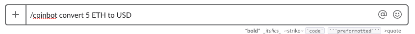

:title: Intro to Testing
:css: style.css

An introduction to effective testing for Python applications.

.. footer::

    .. image:: images/logo-icon.png

    http://github.com/pymetrics

----

This is a Test
==============

.. include:: src/snippets/test_01.py
    :code: python

I know it's a test, becuase:

- It is a subclass of ``unittest.TestCase``
- It has methods that start with the word "test".

----

NOTE
====

All of the code on these slides is real code, in real python files! Similary,
all of the test output is real test output. No fake news here!

----

Assert your correctness
=======================

Your tests "assert" things about the state of the world. If your
assertions are true, your test passes:

.. code:: python

    self.assertEqual(2 + 4, 4 + 2)

::

    $ python -m unittest test_01.py
    .
    ----------------------------------------------------------------------
    Ran 1 test in 0.000s

    OK

----

Or discover your failings
=========================

If your assertions are incorrect, your test will fail:

.. include:: src/snippets/test_02.py
    :code: python

::

    $ python -m unittest test_02.py
    F
    ======================================================================
    FAIL: test_subtraction_is_commutative (test_02.BadTest)
    ----------------------------------------------------------------------
    Traceback (most recent call last):
    File "/usr/src/app/presentation/src/snippets/test_02.py", line 5, in test_subtraction_is_commutative
        self.assertEqual(4 - 2, 2 - 4)
    AssertionError: 2 != -2

    ----------------------------------------------------------------------
    Ran 1 test in 0.002s

    FAILED (failures=1)

----

Some assertions we can make
===========================

.. raw:: html

    <table border="1" class="docutils">
    <colgroup>
    <col width="48%">
    <col width="34%">
    <col width="18%">
    </colgroup>
    <thead valign="bottom">
    <tr class="row-odd"><th class="head">Method</th>
    <th class="head">Checks that</th>
    <th class="head">New in</th>
    </tr>
    </thead>
    <tbody valign="top">
    <tr class="row-even"><td><a class="reference internal" href="#unittest.TestCase.assertEqual" title="unittest.TestCase.assertEqual"><code class="xref py py-meth docutils literal">assertEqual(a, b)</code></a></td>
    <td><code class="docutils literal">a == b</code></td>
    <td>&nbsp;</td>
    </tr>
    <tr class="row-odd"><td><a class="reference internal" href="#unittest.TestCase.assertNotEqual" title="unittest.TestCase.assertNotEqual"><code class="xref py py-meth docutils literal">assertNotEqual(a, b)</code></a></td>
    <td><code class="docutils literal">a != b</code></td>
    <td>&nbsp;</td>
    </tr>
    <tr class="row-even"><td><a class="reference internal" href="#unittest.TestCase.assertTrue" title="unittest.TestCase.assertTrue"><code class="xref py py-meth docutils literal">assertTrue(x)</code></a></td>
    <td><code class="docutils literal">bool(x) is True</code></td>
    <td>&nbsp;</td>
    </tr>
    <tr class="row-odd"><td><a class="reference internal" href="#unittest.TestCase.assertFalse" title="unittest.TestCase.assertFalse"><code class="xref py py-meth docutils literal">assertFalse(x)</code></a></td>
    <td><code class="docutils literal">bool(x) is False</code></td>
    <td>&nbsp;</td>
    </tr>
    <tr class="row-even"><td><a class="reference internal" href="#unittest.TestCase.assertIs" title="unittest.TestCase.assertIs"><code class="xref py py-meth docutils literal">assertIs(a, b)</code></a></td>
    <td><code class="docutils literal">a is b</code></td>
    <td>3.1</td>
    </tr>
    <tr class="row-odd"><td><a class="reference internal" href="#unittest.TestCase.assertIsNot" title="unittest.TestCase.assertIsNot"><code class="xref py py-meth docutils literal">assertIsNot(a, b)</code></a></td>
    <td><code class="docutils literal">a is not b</code></td>
    <td>3.1</td>
    </tr>
    <tr class="row-even"><td><a class="reference internal" href="#unittest.TestCase.assertIsNone" title="unittest.TestCase.assertIsNone"><code class="xref py py-meth docutils literal">assertIsNone(x)</code></a></td>
    <td><code class="docutils literal">x is None</code></td>
    <td>3.1</td>
    </tr>
    <tr class="row-odd"><td><a class="reference internal" href="#unittest.TestCase.assertIsNotNone" title="unittest.TestCase.assertIsNotNone"><code class="xref py py-meth docutils literal">assertIsNotNone(x)</code></a></td>
    <td><code class="docutils literal">x is not None</code></td>
    <td>3.1</td>
    </tr>
    <tr class="row-even"><td><a class="reference internal" href="#unittest.TestCase.assertIn" title="unittest.TestCase.assertIn"><code class="xref py py-meth docutils literal">assertIn(a, b)</code></a></td>
    <td><code class="docutils literal">a in b</code></td>
    <td>3.1</td>
    </tr>
    <tr class="row-odd"><td><a class="reference internal" href="#unittest.TestCase.assertNotIn" title="unittest.TestCase.assertNotIn"><code class="xref py py-meth docutils literal">assertNotIn(a, b)</code></a></td>
    <td><code class="docutils literal">a not in b</code></td>
    <td>3.1</td>
    </tr>
    <tr class="row-even"><td><a class="reference internal" href="#unittest.TestCase.assertIsInstance" title="unittest.TestCase.assertIsInstance"><code class="xref py py-meth docutils literal">assertIsInstance(a, b)</code></a></td>
    <td><code class="docutils literal">isinstance(a, b)</code></td>
    <td>3.2</td>
    </tr>
    <tr class="row-odd"><td><a class="reference internal" href="#unittest.TestCase.assertNotIsInstance" title="unittest.TestCase.assertNotIsInstance"><code class="xref py py-meth docutils literal">assertNotIsInstance(a, b)</code></a></td>
    <td><code class="docutils literal">not isinstance(a, b)</code></td>
    <td>3.2</td>
    </tr>
    </tbody>
    </table>

See https://docs.python.org/3/library/unittest.html#unittest.TestCase

----

Assertions for side effects
===========================

We can check also for things like exceptions being thrown, or logging statements
being made:

.. raw:: html

    <table border="1" class="docutils">
    <colgroup>
    <col width="53%">
    <col width="36%">
    <col width="11%">
    </colgroup>
    <thead valign="bottom">
    <tr class="row-odd"><th class="head">Method</th>
    <th class="head">Checks that</th>
    <th class="head">New in</th>
    </tr>
    </thead>
    <tbody valign="top">
    <tr class="row-even"><td><a class="reference internal" href="#unittest.TestCase.assertRaises" title="unittest.TestCase.assertRaises"><code class="xref py py-meth docutils literal">assertRaises(exc, fun, *args, **kwds)</code></a></td>
    <td><code class="docutils literal">fun(*args, **kwds)</code> raises <em>exc</em></td>
    <td>&nbsp;</td>
    </tr>
    <tr class="row-odd"><td><a class="reference internal" href="#unittest.TestCase.assertRaisesRegex" title="unittest.TestCase.assertRaisesRegex"><code class="xref py py-meth docutils literal">assertRaisesRegex(exc, r, fun, *args, **kwds)</code></a></td>
    <td><code class="docutils literal">fun(*args, **kwds)</code> raises <em>exc</em>
    and the message matches regex <em>r</em></td>
    <td>3.1</td>
    </tr>
    <tr class="row-even"><td><a class="reference internal" href="#unittest.TestCase.assertWarns" title="unittest.TestCase.assertWarns"><code class="xref py py-meth docutils literal">assertWarns(warn, fun, *args, **kwds)</code></a></td>
    <td><code class="docutils literal">fun(*args, **kwds)</code> raises <em>warn</em></td>
    <td>3.2</td>
    </tr>
    <tr class="row-odd"><td><a class="reference internal" href="#unittest.TestCase.assertWarnsRegex" title="unittest.TestCase.assertWarnsRegex"><code class="xref py py-meth docutils literal">assertWarnsRegex(warn, r, fun, *args, **kwds)</code></a></td>
    <td><code class="docutils literal">fun(*args, **kwds)</code> raises <em>warn</em>
    and the message matches regex <em>r</em></td>
    <td>3.2</td>
    </tr>
    <tr class="row-even"><td><a class="reference internal" href="#unittest.TestCase.assertLogs" title="unittest.TestCase.assertLogs"><code class="xref py py-meth docutils literal">assertLogs(logger, level)</code></a></td>
    <td>The <code class="docutils literal">with</code> block logs on <em>logger</em>
    with minimum <em>level</em></td>
    <td>3.4</td>
    </tr>
    </tbody>
    </table>

----

An example: Test for an Exception:
==================================

.. include:: src/snippets/test_03.py
    :code: python

::

    $ python -m unittest test_03.py
    .
    ----------------------------------------------------------------------
    Ran 1 test in 0.000s

    OK

----

Test for... NOT an exception:
=============================

Sometimes we want to test that a particular exception DOESN'T get thrown:

.. include:: src/snippets/test_04.py
    :code: python

::

    $ python -m unittest test_04.py
    ..
    ----------------------------------------------------------------------
    Ran 2 tests in 0.000s

    OK

----

Test lifecyle hooks
===================

When our tests need to manage state, ``TestCase`` gives us a couple of hooks:

.. code:: python

    @classmethod
    def setUpClass(cls):
        """A class method called before tests in an individual class run."""

    def setUp(self):
        """This runs before each test method in your TestCase."""

    def tearDown(self):
        """This runs after each test method."""

    @classmethod
    def tearDownClass(cls):
        """A class method called after tests in an individual class have run."""

----

Using lifecycle hooks to manage a DB connection
===============================================

.. include:: src/snippets/test_05.py
    :code: python

----

The SQL
=======

Running that test will result in the following SQL statements to be executed:

.. code:: SQL

    -- setUpClass()
    -- get the connection
    CREATE TABLE people (first, last);
    INSERT INTO people VALUES [("Cersei", "Lannister"), ("Jon", "Snow")];
    COMMIT;

    -- setUp()
    BEGIN;

    -- test_adding_a_new_person
    INSERT INTO people VALUES ('Arya', 'Stark');
    SELECT count(*) from people;  -- there are 3

    -- tearDown()
    ROLLBACK;

    -- setUp()
    BEGIN;

    -- test_we_reverted
    SELECT count(*) from people;  -- there are 2

    -- tearDown()
    ROLLBACK;

    -- tearDownClass()
    -- closes the connection

----

The results:
============

::

    python -m unittest test_05.py
    ..
    ----------------------------------------------------------------------
    Ran 2 tests in 0.001s

    OK

Sweet.

----

Let's do something interesting
======================================

We can't write tests in a void, we need somethign to test! Let's say we're
building a Slack bot that will tell us our crypto-coin balances, converted
to fiat units.

----

Here's our ``SlackUser`` model
==============================

.. include:: src/coinbot/accounts/models/user.py
    :code: python

We've replace the default ``auth.User`` with something a little more
suited to our needs.

----

And a ``CoinAccount`` model
===========================

.. include:: src/coinbot/accounts/models/account.py
    :code: python

The ``get_balance_in_fiat`` method is doing all the heavy lifting. It
gets the current price of whatever coin is in the account, then multiplies
by the balance to get the amount in our desired currency.

----

What's that ``get_price`` function all about?
=============================================

Pretty simple, a ``GET`` to the Coinbase API using the ``requests`` library

.. include:: src/coinbot/coinbase.py
    :code: python

A sample response from Coinbase looks like this:

::

    $ curl https://api.coinbase.com/v2/prices/BTC-USD/spot

.. code:: json

    {
        "data": {
            "base": "BTC",
            "currency": "USD",
            "amount": "8577.01"
        }
    }

----

This is a basic unit test.
==========================

Let's check that our ``CoinAccount`` actually defaults to a zero balance.

.. include:: src/coinbot/accounts/tests/test_account_creation.py
    :code: python

----

Running Tests
==================

::

    $ python manage.py test

::

    .
    ----------------------------------------------------------------------
    Ran 1 test in 0.000s

    OK
