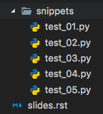
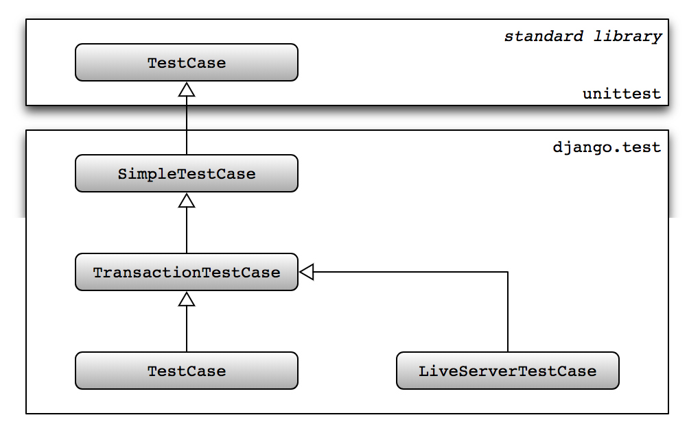

:title: Intro to Testing
:css: style.css

An introduction to effective testing for Python applications.

.. footer::

    .. image:: images/logo-icon.png

    http://github.com/pymetrics

----

This is a Test
==============

.. include:: src/snippets/test_01.py
    :code: python

I know it's a test, becuase:

- It is a subclass of ``unittest.TestCase``
- It has methods that start with the word "test".

----

A quick aside
=============

All of the code on these slides is real code, in real python files! Similary,
all of the test output is real test output. No fake news here!

They get dynamically included in these slides via import statements that look like this:

::

    .. include:: src/snippets/test_01.py
        :code: python

----

Assert your correctness
=======================

Your tests "assert" things about the state of the world. If your
assertions are true, your test passes:

.. code:: python

    self.assertEqual(2 + 4, 4 + 2)

::

    $ python -m unittest test_01.py
    .
    ----------------------------------------------------------------------
    Ran 1 test in 0.000s

    OK

----

Or discover your failings
=========================

If your assertions are incorrect, your test will fail:

.. include:: src/snippets/test_02.py
    :code: python

::

    $ python -m unittest test_02.py
    F
    ======================================================================
    FAIL: test_subtraction_is_commutative (test_02.BadTest)
    ----------------------------------------------------------------------
    Traceback (most recent call last):
    File "/usr/src/app/presentation/src/snippets/test_02.py", line 5, in test_subtraction_is_commutative
        self.assertEqual(4 - 2, 2 - 4)
    AssertionError: 2 != -2

    ----------------------------------------------------------------------
    Ran 1 test in 0.002s

    FAILED (failures=1)

----

Some assertions we can make
===========================

.. raw:: html

    <table border="1" class="docutils">
    <colgroup>
    <col width="48%">
    <col width="34%">
    <col width="18%">
    </colgroup>
    <thead valign="bottom">
    <tr class="row-odd"><th class="head">Method</th>
    <th class="head">Checks that</th>
    <th class="head">New in</th>
    </tr>
    </thead>
    <tbody valign="top">
    <tr class="row-even"><td><a class="reference internal" href="#unittest.TestCase.assertEqual" title="unittest.TestCase.assertEqual"><code class="xref py py-meth docutils literal">assertEqual(a, b)</code></a></td>
    <td><code class="docutils literal">a == b</code></td>
    <td>&nbsp;</td>
    </tr>
    <tr class="row-odd"><td><a class="reference internal" href="#unittest.TestCase.assertNotEqual" title="unittest.TestCase.assertNotEqual"><code class="xref py py-meth docutils literal">assertNotEqual(a, b)</code></a></td>
    <td><code class="docutils literal">a != b</code></td>
    <td>&nbsp;</td>
    </tr>
    <tr class="row-even"><td><a class="reference internal" href="#unittest.TestCase.assertTrue" title="unittest.TestCase.assertTrue"><code class="xref py py-meth docutils literal">assertTrue(x)</code></a></td>
    <td><code class="docutils literal">bool(x) is True</code></td>
    <td>&nbsp;</td>
    </tr>
    <tr class="row-odd"><td><a class="reference internal" href="#unittest.TestCase.assertFalse" title="unittest.TestCase.assertFalse"><code class="xref py py-meth docutils literal">assertFalse(x)</code></a></td>
    <td><code class="docutils literal">bool(x) is False</code></td>
    <td>&nbsp;</td>
    </tr>
    <tr class="row-even"><td><a class="reference internal" href="#unittest.TestCase.assertIs" title="unittest.TestCase.assertIs"><code class="xref py py-meth docutils literal">assertIs(a, b)</code></a></td>
    <td><code class="docutils literal">a is b</code></td>
    <td>3.1</td>
    </tr>
    <tr class="row-odd"><td><a class="reference internal" href="#unittest.TestCase.assertIsNot" title="unittest.TestCase.assertIsNot"><code class="xref py py-meth docutils literal">assertIsNot(a, b)</code></a></td>
    <td><code class="docutils literal">a is not b</code></td>
    <td>3.1</td>
    </tr>
    <tr class="row-even"><td><a class="reference internal" href="#unittest.TestCase.assertIsNone" title="unittest.TestCase.assertIsNone"><code class="xref py py-meth docutils literal">assertIsNone(x)</code></a></td>
    <td><code class="docutils literal">x is None</code></td>
    <td>3.1</td>
    </tr>
    <tr class="row-odd"><td><a class="reference internal" href="#unittest.TestCase.assertIsNotNone" title="unittest.TestCase.assertIsNotNone"><code class="xref py py-meth docutils literal">assertIsNotNone(x)</code></a></td>
    <td><code class="docutils literal">x is not None</code></td>
    <td>3.1</td>
    </tr>
    <tr class="row-even"><td><a class="reference internal" href="#unittest.TestCase.assertIn" title="unittest.TestCase.assertIn"><code class="xref py py-meth docutils literal">assertIn(a, b)</code></a></td>
    <td><code class="docutils literal">a in b</code></td>
    <td>3.1</td>
    </tr>
    <tr class="row-odd"><td><a class="reference internal" href="#unittest.TestCase.assertNotIn" title="unittest.TestCase.assertNotIn"><code class="xref py py-meth docutils literal">assertNotIn(a, b)</code></a></td>
    <td><code class="docutils literal">a not in b</code></td>
    <td>3.1</td>
    </tr>
    <tr class="row-even"><td><a class="reference internal" href="#unittest.TestCase.assertIsInstance" title="unittest.TestCase.assertIsInstance"><code class="xref py py-meth docutils literal">assertIsInstance(a, b)</code></a></td>
    <td><code class="docutils literal">isinstance(a, b)</code></td>
    <td>3.2</td>
    </tr>
    <tr class="row-odd"><td><a class="reference internal" href="#unittest.TestCase.assertNotIsInstance" title="unittest.TestCase.assertNotIsInstance"><code class="xref py py-meth docutils literal">assertNotIsInstance(a, b)</code></a></td>
    <td><code class="docutils literal">not isinstance(a, b)</code></td>
    <td>3.2</td>
    </tr>
    </tbody>
    </table>

See https://docs.python.org/3/library/unittest.html#unittest.TestCase

----

Assertions for side effects
===========================

We can check also for things like exceptions being thrown, or logging statements
being made:

.. raw:: html

    <table border="1" class="docutils">
    <colgroup>
    <col width="53%">
    <col width="36%">
    <col width="11%">
    </colgroup>
    <thead valign="bottom">
    <tr class="row-odd"><th class="head">Method</th>
    <th class="head">Checks that</th>
    <th class="head">New in</th>
    </tr>
    </thead>
    <tbody valign="top">
    <tr class="row-even"><td><a class="reference internal" href="#unittest.TestCase.assertRaises" title="unittest.TestCase.assertRaises"><code class="xref py py-meth docutils literal">assertRaises(exc, fun, *args, **kwds)</code></a></td>
    <td><code class="docutils literal">fun(*args, **kwds)</code> raises <em>exc</em></td>
    <td>&nbsp;</td>
    </tr>
    <tr class="row-odd"><td><a class="reference internal" href="#unittest.TestCase.assertRaisesRegex" title="unittest.TestCase.assertRaisesRegex"><code class="xref py py-meth docutils literal">assertRaisesRegex(exc, r, fun, *args, **kwds)</code></a></td>
    <td><code class="docutils literal">fun(*args, **kwds)</code> raises <em>exc</em>
    and the message matches regex <em>r</em></td>
    <td>3.1</td>
    </tr>
    <tr class="row-even"><td><a class="reference internal" href="#unittest.TestCase.assertWarns" title="unittest.TestCase.assertWarns"><code class="xref py py-meth docutils literal">assertWarns(warn, fun, *args, **kwds)</code></a></td>
    <td><code class="docutils literal">fun(*args, **kwds)</code> raises <em>warn</em></td>
    <td>3.2</td>
    </tr>
    <tr class="row-odd"><td><a class="reference internal" href="#unittest.TestCase.assertWarnsRegex" title="unittest.TestCase.assertWarnsRegex"><code class="xref py py-meth docutils literal">assertWarnsRegex(warn, r, fun, *args, **kwds)</code></a></td>
    <td><code class="docutils literal">fun(*args, **kwds)</code> raises <em>warn</em>
    and the message matches regex <em>r</em></td>
    <td>3.2</td>
    </tr>
    <tr class="row-even"><td><a class="reference internal" href="#unittest.TestCase.assertLogs" title="unittest.TestCase.assertLogs"><code class="xref py py-meth docutils literal">assertLogs(logger, level)</code></a></td>
    <td>The <code class="docutils literal">with</code> block logs on <em>logger</em>
    with minimum <em>level</em></td>
    <td>3.4</td>
    </tr>
    </tbody>
    </table>

----

An example: Test for an Exception:
==================================

.. include:: src/snippets/test_03.py
    :code: python

::

    $ python -m unittest test_03.py
    .
    ----------------------------------------------------------------------
    Ran 1 test in 0.000s

    OK

----

Test for... NOT an exception:
=============================

Sometimes we want to test that a particular exception DOESN'T get thrown:

.. include:: src/snippets/test_04.py
    :code: python

::

    $ python -m unittest test_04.py
    ..
    ----------------------------------------------------------------------
    Ran 2 tests in 0.000s

    OK

----

Test lifecyle hooks
===================

When our tests need to manage state, ``TestCase`` gives us a couple of hooks:

.. code:: python

    @classmethod
    def setUpClass(cls):
        """A class method called before tests in an individual class run."""

    def setUp(self):
        """This runs before each test method in your TestCase."""

    def tearDown(self):
        """This runs after each test method."""

    @classmethod
    def tearDownClass(cls):
        """A class method called after tests in an individual class have run."""

----

Using lifecycle hooks to manage a DB connection
===============================================

.. include:: src/snippets/test_05.py
    :code: python

----

The SQL
=======

Running that test will result in the following SQL statements to be executed:

.. code:: SQL

    -- setUpClass()
    -- get the connection
    CREATE TABLE people (first, last);
    INSERT INTO people VALUES ("Cersei", "Lannister"), ("Jon", "Snow");
    COMMIT;

    -- setUp()
    BEGIN;

    -- test_adding_a_new_person()
    INSERT INTO people VALUES ('Arya', 'Stark');
    SELECT count(*) from people;  -- there are 3

    -- tearDown()
    ROLLBACK;

    -- setUp()
    BEGIN;

    -- test_we_reverted()
    SELECT count(*) from people;  -- there are 2

    -- tearDown()
    ROLLBACK;

    -- tearDownClass()
    -- closes the connection

----

The results:
============

::

    python -m unittest test_05.py
    ..
    ----------------------------------------------------------------------
    Ran 2 tests in 0.001s

    OK

Sweet.

----

Let's do something interesting
======================================

We can't write tests in a void, we need something to test! Let's say we're
building a Slack bot that will tell us our crypto-coin balances, converted
to fiat units.

----

Here's our ``SlackUser`` model
==============================

.. include:: src/coinbot/accounts/models/user.py
    :code: python

We've replace the default ``auth.User`` with something a little more
suited to our needs.

----

And a ``CoinAccount`` model
===========================

.. include:: src/coinbot/accounts/models/account.py
    :code: python

The ``get_balance_in_fiat`` method is doing all the heavy lifting. It
gets the current price of whatever coin is in the account, then multiplies
by the balance to get the amount in our desired currency.

----

What's that ``get_price`` function all about?
=============================================

Pretty simple, a ``GET`` to the Coinbase API using the ``requests`` library

.. include:: src/coinbot/coinbase.py
    :code: python

A sample response from Coinbase looks like this:

::

    $ curl https://api.coinbase.com/v2/prices/BTC-USD/spot

.. code:: json

    {
        "data": {
            "base": "BTC",
            "currency": "USD",
            "amount": "8577.01"
        }
    }

----

This is a basic unit test.
==========================

Let's check that our ``CoinAccount`` actually defaults to a zero balance.

.. include:: src/coinbot/accounts/tests/test_account_creation.py
    :code: python

----

Wait, what is that import?
==========================

.. code:: python

    from django.test import TestCase

Didn't I say that to be a test, you had to subclass ``unittest.TestCase``? What
does Django have to do with that?

----

``TestCase`` hierarchy
======================

----

``django.test.SimpleTestCase``
==============================

A subclass of unittest.TestCase that adds this functionality:

- Some useful assertions like:

    - Checking that a callable raises a certain exception.
    - Testing form field rendering and error treatment.
    - Testing HTML responses for the presence/lack of a given fragment.
    - Verifying that a template has/hasn't been used to generate a given response content.
    - Verifying a HTTP redirect is performed by the app.
    - Robustly testing two HTML fragments for equality/inequality or containment.
    - Robustly testing two XML fragments for equality/inequality.
    - Robustly testing two JSON fragments for equality.
- The ability to run tests with modified settings.
- Using the client Client.

**NOTE**

``SimpleTestCase`` doesn't allow database queries*

----

``django.test.TestCase``
========================

Remember all that connection and transaction handling we did in the lifecycle
example?

.. include:: src/snippets/test_05.py
    :code: python

----

Yeah, ``django.test.TestCase`` does all of that for us.
=======================================================

.. code:: python

    from djang.test import TestCase

    class DBConnectionTest(TestCase):
        fixtures = ['people.json']

        def test_adding_a_new_person(self):
            People.objects.create(first="Arya", last="Stark")
            self.assertEqual(People.objects.count(), 3)

        def test_we_reverted(self):
            self.assertEqual(People.objects.count(), 2)

Each test method automatically gets run in a transaction, which gets rolled
bach afterword.

----

Running Tests, the Django way
=============================

::

    $ python manage.py test

::

    .
    ----------------------------------------------------------------------
    Ran 1 test in 0.000s

    OK

Django gives us a simple management command, which translates a bunch
of settings into the actual command to run.

----

Test Discovery
==============

::

    app/
     |___ tests/
             |___ __init__.py
             |
             |___ test_something.py

In your app, add a ``tests`` package if it isn't already there, and add
files that begin with ``test_``. If you do this, the test runner will find
your tests.

This isn't the only way to do things, but it is the way the Pymetrics web app
is set up.

----

Slack Slash Commands, in a nutshell
===================================

1. We register a Slack app, and give it a URL to POST to.
2. When someone runs our slash command, we get a POST from Slack. It has the
   ``user_id``, ``team_id``, the command text, a ``response_url``, and some
   other stuff.
3. We respond to the ``response_url`` with the data we want to display.

We're glossing over some of the finer details here, but that's the gist of it.
Easy Peasy.

----

What should we test?
====================

Unit Tests
++++++++++

These are tests for specific units of functionality, in relative isolation
from other units. Model methods are often great candidates for these
sorts of tests.

1. Test that our ``CoinAccount.get_balance_in_fiat`` method works.

Integration Tests
+++++++++++++++++

These test the boundaries of systems. A hallmark of an "integration" test
is that it involves multiple components.

1. Test that we return a valid response to a POST from Slack.

-----

A balancing act
===============

Unit Tests v. Integration Tests
+++++++++++++++++++++++++++++++

.. https://pixabay.com/en/balance-swing-equality-measurement-2108022/

----

Testing our ``CoinAccount`` model
=================================

As a refresher, here is the model:

.. include:: src/coinbot/accounts/models/account.py
    :code: python

Let's see about writing a test for ``get_balance_in_fiat``.

----

We have a problem
=================

That pesky ``get_price`` call is no bueno:

1. It is non-deterministic
2. It makes a network request

----

Mock to the rescue!
===================

From the docs:

    ``unittest.mock`` is a library for testing in Python. It allows you to
    replace parts of your system under test with mock objects and make
    assertions about how they have been used.

It was added to the stdlib in Python 3.3, but is available in identical form
for previous version with ``pip install mock``. It's safe to use the official
Python 3 docs even though we're on 2.7, the API hasn't changed.

----

A mini Mock tutorial
====================

A ``Mock`` is basically an object that lets you call anything on it, and
it remembers what you do.

.. code:: python

    >>> from unittest.mock import Mock

    >>> mock_function = Mock()

    >>> mock_function.called
    False

    >>> mock_function()

    >>> mock_function.called
    True

----

A Mock remembers what arguments it was called with
==================================================

.. code:: python

    >>> mock_function('foo')

    >>> mock_function.assert_called_with('foo')

    >>> mock_function.assert_called_with('bar')
    ---------------------------------------------------------------------------
    AssertionError                            Traceback (most recent call last)
    <ipython-input-12-ba4ed0a74c7b> in <module>()
    ----> 1 mock.assert_called_with('bar')

    /usr/local/Cellar/python3/3.6.4_2/Frameworks/Python.framework/Versions/3.6/lib/python3.6/unittest/mock.py in assert_called_with(_mock_self, *args, **kwargs)
        812         if expected != actual:
        813             cause = expected if isinstance(expected, Exception) else None
    --> 814             raise AssertionError(_error_message()) from cause
        815
        816

    AssertionError: Expected call: mock('bar')
    Actual call: mock('foo')

----

Mocks can act like classes
==========================

Because calling arbitrary methods on a ``Mock`` silently create and attach
another ``Mock``.

.. code:: python

    >>> from unittest.mock import Mock

    >>> instance = Mock()

    >>> instance.save()
    <Mock name='mock.Mock().save()' id='4564852808'>

    >>> instance.save.call_count
    1

----

``MagicMock``
=====================

It implements most of the "magic" or "dunder" methods:

Methods and their defaults:

- __lt__: NotImplemented
- __gt__: NotImplemented
- __le__: NotImplemented
- __ge__: NotImplemented
- __int__: 1
- __contains__: False
- __len__: 0
- __iter__: iter([])
- __exit__: False
- __complex__: 1j
- __float__: 1.0
- __bool__: True
- __index__: 1
- __hash__: default hash for the mock
- __str__: default str for the mock
- __sizeof__: default sizeof for the mock

99% of the time, you might as well use a ``MagicMock`` over a plain old ``Mock``

----

Mock in action
==============

.. include:: src/coinbot/accounts/tests/test_get_balance_in_fiat.py
    :code: python

----

Uh, what's a patch?
===================

A patch replaces an imported object with a ``MagicMock``

Kinda like a monkeypatch, except cute and sweet instead ugly and scary.

----

What's with that patch path?
============================

Our test is patching here:

.. code:: python

    @patch('accounts.models.account.get_price'

but ``get_price`` is defined in ``coinbase.py``:

.. code:: python

    from coinbase import get_price

what gives?

----

Where to patch
==============

Your patch target is the thing you're using, in the place you're using it at.

.. code:: python

    # accounts/models/account.py
    ...
    from coinbase import get_price

So if you're using ``get_price`` in ``accounts.models.account``, you want
to patch ``accounts.models.account.get_price``.

----

The whole example:
==================

.. include:: src/coinbot/coinbase.py
    :code: python

.. include:: src/coinbot/accounts/models/account.py
    :code: python

.. include:: src/coinbot/accounts/tests/test_get_balance_in_fiat.py
    :code: python

----

Running our test
================

::

    python manage.py test accounts.tests.test_get_balance_in_fiat
    Creating test database for alias 'default'...
    System check identified no issues (0 silenced).
    .
    ----------------------------------------------------------------------
    Ran 1 test in 0.001s

    OK
    Destroying test database for alias 'default'...

Sweet.

----

For our integration test example, a form:
=========================================

.. include:: src/coinbot/accounts/forms.py
    :code: python

----

And a view
==========

.. include:: src/coinbot/accounts/views.py
    :code: python

Notice this view is nice and skinny.

    Fat models, skinny views FTW

----

Finally, our test:
==================

.. include:: src/coinbot/accounts/tests/test_slash_command_post.py
    :code: python

----

Fin
===

::

    python manage.py test accounts.tests.test_slash_command_post
    Creating test database for alias 'default'...
    System check identified no issues (0 silenced).
    .
    ----------------------------------------------------------------------
    Ran 1 test in 0.007s

    OK
    Destroying test database for alias 'default'...

Sweet.
